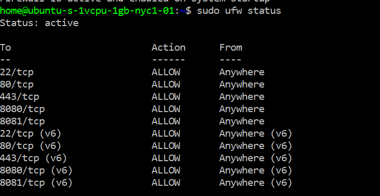

# Understanding Network Final

The purpose of the project is to understand what goes into the IoT device to post/put sensor data into a database on a server and access it. I referenced several resources for this project:

- [itp-connected-devices repo by Don](https://github.com/don/itp-connected-devices)
- [Node Examples by Tom Igoe](https://github.com/tigoe/NodeExamples) [Specifically the folders [ExpressIntro](https://github.com/tigoe/NodeExamples/tree/master/ExpressIntro) and [MySqlServer](https://github.com/tigoe/NodeExamples/tree/master/MySqlServer)]
- [SimpleWebServer.ino](https://github.com/tigoe/MakingThingsTalk2/blob/master/3rd_edition/chapter4/SimpleWebServer/SimpleWebServer.ino)
- [Understanding Network Course Syllabus](https://itp.nyu.edu/classes/undnet/)
- [Checking internet connection in Arduino](https://github.com/tigoe/Wifi101_examples/blob/master/ConnectionTestLogger/ConnectionTestLogger.ino)

So for the final result, I created this github to put all the scattered practice in one. It includes the process of setting up the remote server on digital ocean, posting data to the server, creating MySQL database with node and express, then creating the API for client access. 

# Hardware

I just wanted to get the environment reading in my bedroom in Crown Heights, Brooklyn. So I used the following two sensors for the moisture level and mic level with my Nano IoT 33. 

## Sensors

TBD

# Schematics

TBD

# Process

1. Virtual Host 
2. Arduino Posting/Putting Data 
3. Getting Data on virtual machine 
4. MySQL database 

# Virtual Host

- [Followed making the virtual host from digital ocean](https://itp.nyu.edu/networks/setting-up-a-virtual-host/)
- [helpful tutorial to assist the tutorial above](https://www.digitalocean.com/community/tutorials/initial-server-setup-with-ubuntu-18-04)




- SSH didn't work that well
- But I did try to use the PuTTY Key generator

# Arduino

I tried several different examples from [MakeThingsTalk2](https://github.com/tigoe/MakingThingsTalk2) to figure out ways to post data to the server. There is no code to put with headers so I combined the simple web server with a post with headers to experiment and got it working through trails and errors. 

# MySql

In order to get the list of data rather than the latest single data from the Arduino posting, I had to create a database to store the information. So Tom advised me to look into MySQL. [[Cheatsheet](https://devhints.io/mysql)]

**I did the following steps to get my database working.** 

- [Install MySQL on Ubuntu 20.04](https://www.digitalocean.com/community/tutorials/how-to-install-mysql-on-ubuntu-20-04)
- [Steps to check the tables in mySQL](https://alvinalexander.com/blog/post/mysql/list-tables-in-mysql-database/)
- To uninstall mySQL

    ```cpp
    sudo apt-get remove --purge mysql* 
    sudo apt-get autoremove 
    sudo apt-get autoclean
    ```

- [Using MYSQL with Node](https://eecs.oregonstate.edu/ecampus-video/CS290/core-content/node-mysql/using-server-sql.html)
- Quick way to access the data from conn_dev (database name) in MYSQL

    ```cpp
    SHOW DATABASES; USE conn_dev; SHOW TABLES;
    SELECT * FROM data;
    INSERT INTO data (micVal, waterVal) VALUES (20,100);
    ```

The joy of making it work is insurmountable. 


- Posting data forever using forever npm lib. [Follow the tutorial here.](https://buildcoding.com/useful-forever-commands-for-node-js-beginner/)
- [Accessing the timestamp in MYSQL](https://popsql.com/learn-sql/mysql/how-to-query-date-and-time-in-mysql) through node
- schedule with [crontab](https://crontab.guru/#0_1-30_12_*)

# NODE

- started off following Don's [example](https://github.com/don/itp-connected-devices/blob/master/app.js)
    - I deleted the macAddress and authroization elements since mine is very simple
- replaced POST with PUT in Arduino and Node
- [decoding](https://developer.mozilla.org/zh-CN/docs/Web/JavaScript/Reference/Global_Objects/decodeURI) and encoding the time user puts in the browser

# API End Points

[API End Points](assets/API%20End%20Points%20e51deb5edbe84b8785f30c2757a17705.csv)

# Client Side

- Simple UI design
- [DEMO web here](https://envirobk.netlify.app/) [Cureently in the process of making it show on the server's home page]

## CSS generator

I used several generators to speed up my process.

- [grid](https://cssgrid-generator.netlify.app/)
- [button](https://cssgrid-generator.netlify.app/)
- [scroller](http://webkit-scroll-gen.sourceforge.net/)
- [input](http://doodlenerd.com/html-control/css-input-range-generator)

Some examples I used include

- [hex to rgb converter](https://www.rapidtables.com/convert/color/hex-to-rgb.html)
- [slider hovering box](https://css-tricks.com/value-bubbles-for-range-inputs/)

# Discovery

1. windows do not like single quotes. should replace '' with "".
2. Error in node and mysql is normally caused by forgetting to write 

    ```cpp
    source .env
    ```

    

    If below does not work, try to alter the user again by following the code below 

    ```cpp
    ALTER USER 'root'@'localhost' IDENTIFIED WITH mysql_native_password BY 'password';
    flush privileges;
    quit;
    ```

    In your folder with server.js, write

    ```cpp
    source .env
    node server.js
    ```

3. if you close the terminal after you started it, it will close the server. In order to have server always running, use forever npm lib. 
4. To make vscode remote, follow [this](https://itp.nyu.edu/networks/setting-up-a-raspberry-pi/)  [As of 12/8/2020, I still have error. Will look into it during winter brea]

    

5. If I have two applications using the same address, try to find out the PID and kill it 

    ```cpp
    sudo lsof -i :8081
    kill -9 {PID}
    ```

6. make sure the port number you are running and in your code is the same 
7. Figure out the command in mySQL and then copy paste in your node script 

# Conclusion

TBD